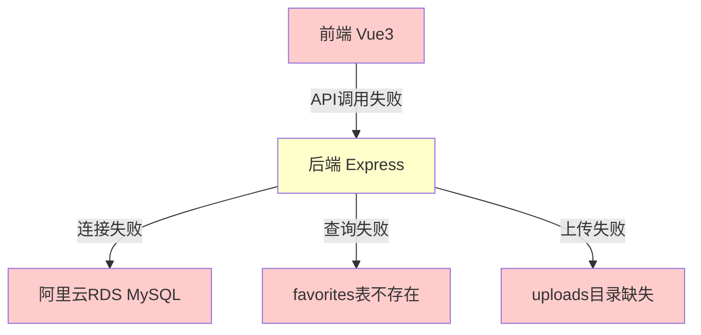
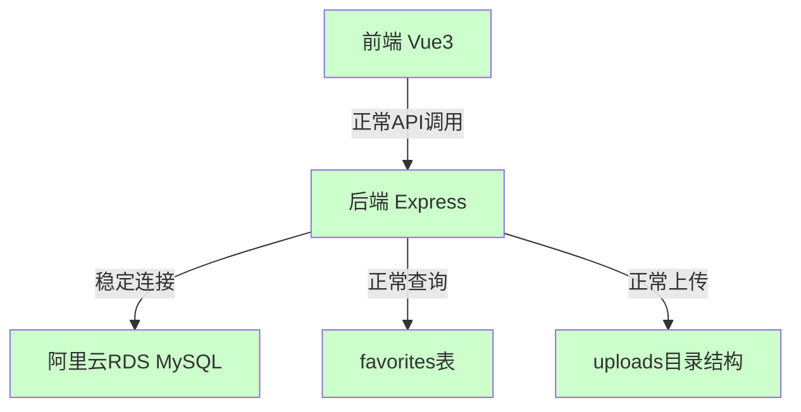
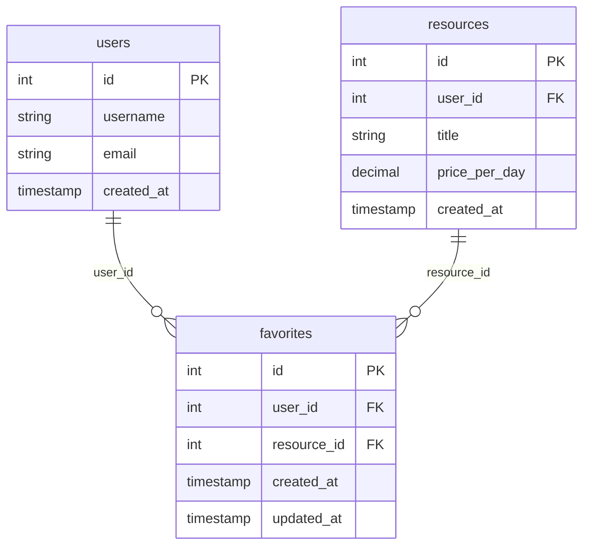

# 数据库连接和Favorites表修复设计文档

## 概述

本设计文档详细描述了如何系统性地解决租赁平台的数据库连接问题，包括favorites表缺失、权限配置、图片上传功能和前端网络连接等问题的技术解决方案。

## 架构分析

### 当前问题架构图



### 目标架构图



## 组件设计

### 1. 数据库连接组件修复

#### 问题分析
- 当前配置：`rm-bp1sva9582w011209.mysql.rds.aliyuncs.com`
- 权限错误：`Access denied for user 'root'@'172.18.152.12'`
- 白名单配置：已设置但仍有权限问题

#### 解决方案
```javascript
// 数据库连接配置优化
const connectionConfig = {
    host: process.env.DB_HOST,
    port: 3306,
    user: process.env.DB_USER,
    password: process.env.DB_PASSWORD,
    database: process.env.DB_NAME,
    charset: 'utf8mb4',
    connectionLimit: 10,
    acquireTimeout: 60000,
    timeout: 60000,
    reconnect: true,
    idleTimeout: 300000
};
```

#### 连接重试机制
```javascript
async function createConnectionWithRetry(maxRetries = 3) {
    for (let i = 0; i < maxRetries; i++) {
        try {
            const connection = await mysql.createConnection(connectionConfig);
            return connection;
        } catch (error) {
            if (i === maxRetries - 1) throw error;
            await new Promise(resolve => setTimeout(resolve, 2000 * (i + 1)));
        }
    }
}
```

### 2. Favorites表结构设计

#### 表结构定义
```sql
CREATE TABLE IF NOT EXISTS favorites (
    id INT PRIMARY KEY AUTO_INCREMENT,
    user_id INT NOT NULL COMMENT '用户ID',
    resource_id INT NOT NULL COMMENT '资源ID',
    created_at TIMESTAMP DEFAULT CURRENT_TIMESTAMP COMMENT '收藏时间',
    updated_at TIMESTAMP DEFAULT CURRENT_TIMESTAMP ON UPDATE CURRENT_TIMESTAMP COMMENT '更新时间',
    UNIQUE KEY unique_favorite (user_id, resource_id),
    FOREIGN KEY (user_id) REFERENCES users(id) ON DELETE CASCADE,
    FOREIGN KEY (resource_id) REFERENCES resources(id) ON DELETE CASCADE,
    INDEX idx_user (user_id),
    INDEX idx_resource (resource_id),
    INDEX idx_created_at (created_at)
) COMMENT '用户收藏表' ENGINE=InnoDB DEFAULT CHARSET=utf8mb4;
```

#### 数据完整性约束
- 用户ID和资源ID的唯一性约束
- 外键约束确保数据一致性
- 索引优化查询性能

### 3. 图片上传系统设计

#### 目录结构设计
```
houduan/uploads/
├── avatars/          # 用户头像
│   ├── thumbnails/   # 头像缩略图
│   └── original/     # 原始头像
├── resources/        # 资源图片
│   ├── thumbnails/   # 资源缩略图
│   └── original/     # 原始资源图片
└── temp/            # 临时上传文件
```

#### 上传中间件配置
```javascript
const multerConfig = {
    storage: multer.diskStorage({
        destination: (req, file, cb) => {
            const uploadPath = path.join(__dirname, '../uploads', req.uploadType || 'temp');
            if (!fs.existsSync(uploadPath)) {
                fs.mkdirSync(uploadPath, { recursive: true });
            }
            cb(null, uploadPath);
        },
        filename: (req, file, cb) => {
            const uniqueSuffix = Date.now() + '-' + Math.round(Math.random() * 1E9);
            cb(null, file.fieldname + '-' + uniqueSuffix + path.extname(file.originalname));
        }
    }),
    limits: {
        fileSize: 5 * 1024 * 1024, // 5MB
        files: 5
    },
    fileFilter: (req, file, cb) => {
        const allowedTypes = /jpeg|jpg|png|gif|webp/;
        const extname = allowedTypes.test(path.extname(file.originalname).toLowerCase());
        const mimetype = allowedTypes.test(file.mimetype);
        
        if (mimetype && extname) {
            return cb(null, true);
        } else {
            cb(new Error('只允许上传图片文件'));
        }
    }
};
```

### 4. API错误处理设计

#### 统一错误响应格式
```javascript
const errorHandler = (err, req, res, next) => {
    const error = {
        success: false,
        message: err.message || '服务器内部错误',
        code: err.code || 'INTERNAL_ERROR',
        timestamp: new Date().toISOString(),
        path: req.path
    };
    
    // 数据库相关错误
    if (err.code === 'ER_NO_SUCH_TABLE') {
        error.message = '数据表不存在，请联系管理员';
        error.code = 'DATABASE_TABLE_MISSING';
    }
    
    // 权限相关错误
    if (err.code === 'ER_ACCESS_DENIED_ERROR') {
        error.message = '数据库连接权限不足';
        error.code = 'DATABASE_ACCESS_DENIED';
    }
    
    res.status(err.status || 500).json(error);
};
```

## 数据模型

### Favorites表关系图


## 错误处理策略

### 数据库连接错误处理
1. **连接重试机制**：最多重试3次，间隔递增
2. **连接池管理**：自动重连和连接池监控
3. **错误日志记录**：详细记录连接失败原因
4. **降级策略**：连接失败时返回友好错误信息

### API错误处理
1. **统一错误格式**：标准化的错误响应结构
2. **错误分类**：按错误类型提供不同的处理策略
3. **用户友好提示**：将技术错误转换为用户可理解的信息
4. **错误监控**：记录和监控错误频率

## 测试策略

### 单元测试
- 数据库连接功能测试
- Favorites表CRUD操作测试
- 图片上传功能测试
- 错误处理机制测试

### 集成测试
- 前后端API集成测试
- 数据库事务完整性测试
- 文件上传端到端测试

### 性能测试
- 数据库连接池性能测试
- 并发上传性能测试
- API响应时间测试

## 部署策略

### 分阶段部署
1. **阶段1**：数据库连接修复和favorites表创建
2. **阶段2**：图片上传功能修复
3. **阶段3**：前端错误处理优化
4. **阶段4**：性能优化和监控

### 回滚策略
- 配置文件备份
- 数据库结构备份
- 服务快速回滚机制

## 监控和维护

### 健康检查
- 数据库连接状态监控
- API响应时间监控
- 错误率监控
- 磁盘空间监控（uploads目录）

### 日志策略
- 结构化日志记录
- 错误级别分类
- 日志轮转和清理
- 关键操作审计日志